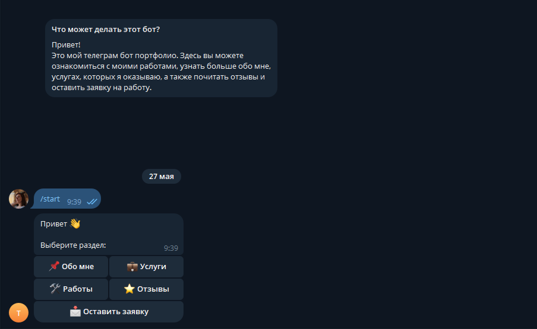

# Telegram Bot — Портфолио

Современный Telegram-бот для сбора заявок с многошаговой формой, валидацией данных и удобным интерфейсом.



## 🚀 Демо-бот

**Живой бот:** [@Randusnam_bot](https://t.me/Randusnam_bot)

Можешь прямо сейчас протестировать функционал.

## Возможности

- ✅ Интерактивное меню с Inline-кнопками
- ✅ Многошаговая FSM-анкета (Имя → Телефон → Комментарий)
- ✅ Умная валидация российского номера телефона
- ✅ Сохранение всех заявок в SQLite базу данных
- ✅ Мгновенные уведомления администратору о новых заявках
- ✅ Чистая модульная архитектура (handlers, states, services)

## Технологии

- **Python 3.11+**
- **aiogram 3.x** — современный асинхронный фреймворк
- **SQLAlchemy** + **aiosqlite** — работа с БД
- **FSM** (Finite State Machine)
- **phonenumbers** — валидация телефонов
- **python-dotenv** — переменные окружения

## Структура проекта

```bash
├── bot.py
├── config.py
├── database.py
├── requirements.txt
├── .env.example
├── data/
│   └── texts.py
├── handlers/
│   └── form.py
├── keyboards/
├── services/
├── states/
└── screenshots/
    ├── menu.png
    ├── message.png
    ├── admin_notification.png
    └── error.png
